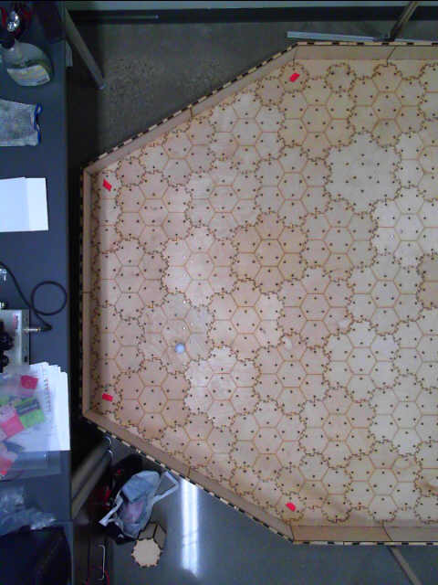
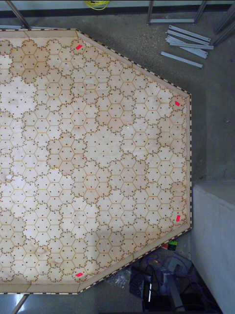
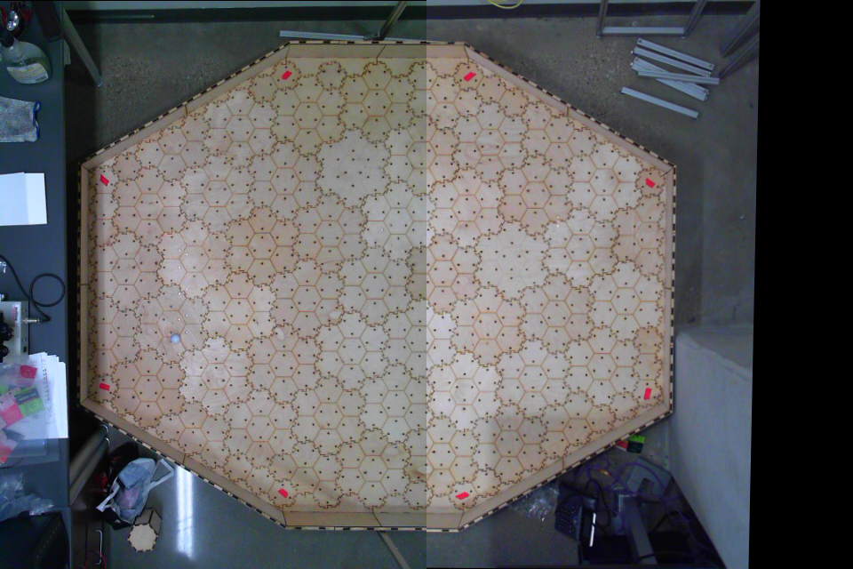
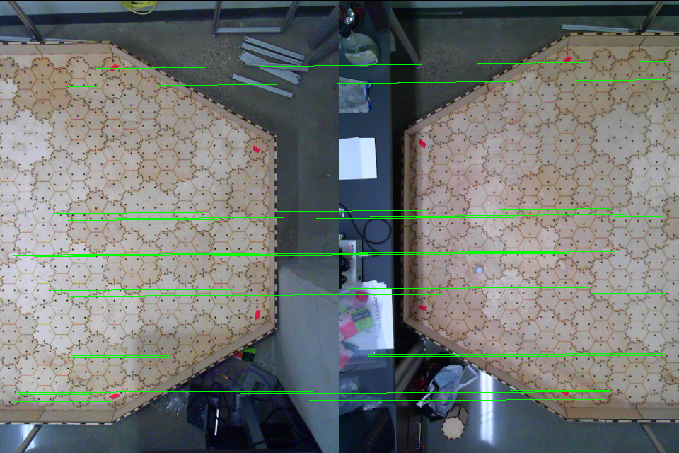
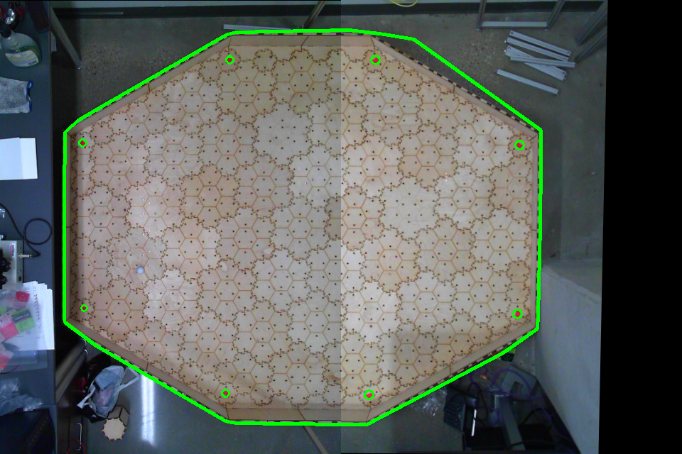
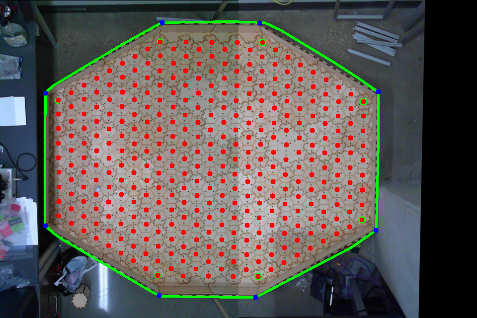

# Effect of Planning Depth in Predator-Prey Behavior
**Michael Wiznitzer**

Northwestern University: Final Project

## Introduction
Nature is a wonder of its own. When we look at animals, we usually see cute furry creatures that seemingly just do their own thing. After seeing them in the wild, though, you begin to notice how they use their environment to hunt or hide from other animals. For [example](https://youtu.be/LhSDxp0oQK8?t=2m51s), a leapord might hide in a narrow valley as it hunts imapla grazing above it. In order to better understand these predator-prey relationships, [research](https://nxr.northwestern.edu/planning-vertebrates) has been done in the NxR lab to simulate how prey will act (using POMDPs) given various planning depths in order to reach some goal position before a predator kills the prey. My project focuses on turning these simulations into a 3-D honeycomb-styled-world realization where Sphero robots act as the predator and prey that have to navigate in various levels of occluded environments.

####  Objective
The goal of this project is to demonstrate the effect of planning-depth in regards to prey being able to reach some goal position before the predator kills it in a 3-D honeycomb-styled-world environment with various levels of occlusion. This project breaks down into 3 different parts listed below:

- Maze Fabrication
- Sphero Control with ROS
- Image Processing to determine robot location in maze

To read more about each part, see my portfolio post [here](https://mechwiz.github.io/Portfolio/prey.html). This repo's purpose is to provide the user with a ROS package to perform sphero control within the maze using computer vision feedback. This covers the latter 2 parts of the project mentioned above (**Sphero Control with ROS** and **Image proecessing to determine robot location in maze**).

## Package Installation
#### Prerequisits
- Linux running on Ubuntu 16.04 with ROS Kinetic. Follow these [instructions](http://wiki.ros.org/kinetic/Installation/Ubuntu) for setting up ROS Kinetic.
- Python3 and Bluetooth LE support. Run the bash script below to achieve this.
```bash
sudo apt-get install python3-pip libglib2.0-dev
sudo pip3 install bluepy
```
- Support for running python3 nodes in ROS. Run the bash script below to achieve this.
```bash
sudo apt-get install python3-yaml
sudo -H pip3 install rospkg
```
- Support for the [imutils](https://github.com/jrosebr1/imutils) image processing library. Run the bash script below to achieve this.
```
sudo apt-get install python-pip
sudo pip install imutils
sudo pip install --upgrade imutils
```

Now run the following bash script in your favorite directory which will create a workspace called `sphero_ws` and clone this repo into it.
```bash
mkdir -p sphero_ws/src; cd sphero_ws/src; catkin_init_workspace
git clone git@github.com:mechwiz/maze_control.git
cd ..; catkin_make; source devel/setup.bash
```
You should now be ready to run the package (at least the master branch).

#### Hardware
- 2 [Microsoft LifeCam Studio](https://www.amazon.com/Microsoft-LifeCam-Studio-for-Business/dp/B0096KSBB0/ref=sr_1_1?ie=UTF8&qid=1544762326&sr=8-1&keywords=lifecam%2Bstudio&th=1) cameras
- Full scale maze environment (see my [other repo](https://github.com/mechwiz/maze_world) detailing the maze setup)
- Camera Rig made from 80/20 extruded Aluminum
- 2 custom made 3D printed camera mounts to attatch the cameras to the camera rig
- 2 [Sphero Minis](https://www.sphero.com/sphero-mini)

#### Sphero API
The Sphero Mini API used in this package was developed by [MProx](https://github.com/MProx) and can be found [here](https://github.com/MProx/Sphero_mini). Some modifications were made in the [library module](src/sphero_mini/sphero_mini.py) so that 2 robots can be controlled simultaneously. As the author notes in his [Readme](https://github.com/MProx/Sphero_mini/blob/master/README.md), bluetooth collisions may happen - possibly due to asynchronous notifications. I have seen this from time to time while running this package so be on the lookout for terminal printouts that look like this:
```bash
[141, 8, 19, 25, 255, 204, 216] ===================> Unknown async packet
[141, 8, 19, 26, 255, 203, 216] ===================> Unknown async packet
[141, 8, 19, 26, 255, 203, 216] ===================> Unknown async packet
[141, 8, 19, 26, 255, 203, 216] ===================> Unknown async packet
```
In the event that this occurs, you will need to reconnect to the sphero over bluetooth which is described in the implementation section below.

As the author further notes, it may take several tries to connect to the spheros over bluetooth. From my experience, if it didn't connect the first time, it usually will connect the second time.

#### Real-Time Image Stitching
Due to the size of the maze environment, multiple cameras are used to provide a real time image feed to the package nodes. While one wider-angle camera could accomplish this as well, the field of view (FOV) of the wider-angled camera could become blocked by occlusions in the maze. This is especially true for obstacles positioned far enough from the camera along the x or y axes. This would prevent the camera from picking up the smaller sized spheros if they were behind said occlusions. With 2 cameras positioned high enough (but not too high, so that camera resolution is still decent), any occlusions that may obstruct the FOV of one camera can be picked up by the other camera.

That said, an adoption of [Adrian Rosebrock's](https://www.pyimagesearch.com/author/adrian/) Real-Time Image-Stitching code (with a thorough description posted [here](https://www.pyimagesearch.com/) on his blog [pyimagesearch](https://www.pyimagesearch.com/)) was used to stitch the 2 camera feeds together. A description of how my adoption works is discussed in the implementation section below.

## Implementation
There are several steps and sidesteps to implementing this package which is discussed below.

1. Plug in the usb cable from camera 1 (signified by a sticker on the cable) into your computer first, and the second cable afterwards. This must be done in this order because the package assumes camera 1 to be the _left_ image and camera 2 to be the _right_ image that will stitched together.

2. Launch the cameras and image stitching node together by running: `roslaunch maze_control start_cam_stitch.launch`. You can also launch them seperately by first running: `roslaunch maze_control usb_2cams.launch` and then `roslaunch maze_control stitch_images.launch`. After doing this, you will notice the following images.

|Left Frame Camera Feed | Right Frame Camera Feed|
|:--------------:|:-------------:|
| |  |

|Stitched Frame |
|:---:|
| |

|Key Points Frame |
|:---:|
| |

You will notice that the **Result** and **Keypoint Matches** frames will change every 0.5 seconds. This is intentional. The idea behind this node is to let you choose the best homography matrix to use that will transform the right hand frame into the left-hand frame so that the resulting image looks literally like a stitched image. Within each 0.5 seconds, the node will calculate a new homagraphy matrix based on the Key Point Matches between the left and right hand frames. If the key-point pairs are matched together with horizontal lines at what seems to be the right places, chances are that it's a good match. Thus, the resulting stitched and key-point images are shown to you so that you have visual feedback to choose the best homography matrix. **The way to choose the best matrix** is by clicking the _Stitched Frame_ image with your mouse, wait until you see a good match, and then hit the "**c**" key on your keyboard. Upon completion of this process, the left, right, and keypoint images will be closed. The homography matrix for the chosen image will be cached and the publishing rate of the stitched image will be restored to 30 hz.

<ol start="3">
<li>Launch the board setup node by running:</li></ol>

```
roslaunch maze_control maze_setup.launch
```
Assuming your color calibration is good for detecting the maze contour and the red tape, you will see the following progression of images from left to right. If the calibration is off, please look [here](launch/color_calibration/README.md) for the appropiate calibration procedure.

|Detection of Maze Contour and Red Tape | Interpolation of Cell Points|
|:--------------:|:-------------:|
| |  |

First, the node will use color segmentation to detect the contour of the maze and then use it again to look for the red tape within that contour. This helps eliminate any red objects that happen to be outside the maze from being detected. To make sure that all the points the node detects (both for the points that make up the maze contour and the red tape points) are valid, it collects 100 samples of each point and takes their corresponding modes. This process may take a few seconds, so the left image above is what you should expect to be seeing during this time. Using the 8 red tape points, all of the other cell points in the maze are interpolated and an image feed lookng like the picture above on the right should appear. All the cell points are then named in the following convention. Assuming the long side of the octagonal maze is vertical, the cells from top to bottom are:

```
A1,A2,A3,...,A9
B1,B2,B3,...,B10
:
:
I1,I2,I3,...,I17
J1,J2,J3,...,J16
K1,K2,K3,...,K17
:
:
Q1,Q2,Q3,...,Q17
R1,R2,R3,...,R16
Y1,Y2,Y3,...,Y9
```
The points are then published so that other nodes can use them for sphero calibration and control.

<ol start="4">
<li>Before you can launch the <b>sphero_finder</b> node, you need to first connect to the spheros. You can do this by running the following 2 commands <b>separately</b> - each one in a separate terminal. Wait for one to finish before starting the next one. Also make sure your bluetooth is turned on. You do not need to "turn on" the spheros for this procedure. They have smart BTLE so they are always listening.</li>
</ol>

```
roslaunch maze_control preymini_sphero.launch
roslaunch maze_control predatormini_sphero.launch
```
The terminal will send a message when each sphero has been connected to succesfully. The prey and predator spheros should initialize with a green and purple color respectively. If you do not see this visial confirmation, you should rerun the corresponding node for that sphero.

<ol start="5">
<li>Launch the sphero finder node by running:</li></ol>

```
roslaunch maze_control spheromini_finder.launch
```
Assuming your color calibration is good for detecting the color of each sphero, you will see the following progression of images from left to right. If the calibration is off, please look [here](launch/color_calibration/README.md) for the appropiate calibration procedure.

|Waiting for map calibration... | Detection of Prey and Predator Spheros|
|:--------------:|:-------------:|
| |  |

First, an image feed of just the stitched image should appear like the one on the left above. Before the node can find the spheros, it must know the layout of the maze contour so that it knows what area to look within and what to ignore. Since we already know this from the last step, all that needs to be done is to let the **maze_setup** node know when to send over this information. To do this, click on the image feed from the **maze_setup** node and hit the "**c**" key when you see a good feed (like the one shown in the last step). Once you do this, you will see a snapshot of the current waypoint configuration of the maze along with the bounded maze contour show up on the image feed from the **sphero_finder** node. If you still don't like the configuration, you may click the image feed from the **maze_setup** node and hit the "**c**" key again until you are satisfied. Once you finish this process, you may terminate the **maze_setup** node by typing "Cntrl+c" into the terminal running that launch file in order to free up some processing power on your machine.

Once you set the configuraiton on the image feed from your **sphero_finder** node, you should see a green circle around the prey sphero and a blue circle around the predator sphero. Currently, the node identifies the prey and predator spheros by their green and purple colors respectively. If you do not see one or both of these circles, then you need to calibrate the color segmentation parameters for detecting them [here](launch/color_calibration/README.md) as mentioned above.

You will also see the paths for each of the spheros to follow. The blue path signifies the path of the prey, and the yellow path signifies the path of the predator. These paths are defined in [path.csv](src/path.csv). The paths are defined by a sequence of the cell names that each sphero will be following.

<ol start="6">
<li>Next, you will need to calibrate the spheros so that their relative frames are transformed into the global frame of the maze and into the camera frame. You can do this by placing each sphero in a relatively open area within the maze and running the following 2 commands <b>separately</b> - each one in a separate terminal. </li>
</ol>

```
roslaunch maze_control calibrate_prey.launch
roslaunch maze_control calibrate_predator.launch
```
After running the launch file, you will need to click the image feed from the **sphero_finder** node and then hit the "**f**" key in order to begin the calibration process. Hitting the "**f**" key will tell the **sphero_finder** node to send over the waypoint information to the calibration node so that the global frame of the maze can be defined relative to the sphero frame. The global frame is considered to have its positive x-axis along the vector from cell "**M1**" to cell "**M17**" which is the middle most row of cells of the octagon stretching along its width. Once the calibration starts, the sphero will move for 1 second on its positive x-axis. The node will then find the offset angle between the vector defined by the start and end position of the robot's trajectory and the vector defining the global frame. It will then find the angle offset between the global frame and the camera frame and add that to the total angle offset representing the angle between the robot's x-axis and the camera's x-axis. This offset is then sent out using a custom service to be available for the **sphero_control** node.

<ol start="7">
<li>The sphero control node can be started by running:</li></ol>

```
roslaunch maze_control spheromomini_control
```
in a terminal. This node is responsible for controlling each sphero such that they each follow their respective paths and do so in a way where one is not too many steps ahead of the other one on its path than the other one is on its path. Each sphero is controlled using PID control using an adapted [PID control library](https://github.com/hydrosquall/SpheroTeam/blob/master/SpheroTeam/pidController.py) meant for sphero control which was originally inspired by a [PID control function](https://www.mathworks.com/matlabcentral/fileexchange/52481-sphero-connectivity-package) found in a Sphero control library in Matlab's File Exchange.

The gains and parameters for the controls can be modified [here](param/sphero_control.yaml) if you would like to tweak them. The parameter descriptions are as follows:
- Kp: Proportional controller gain
- Ki: Integral controller gain
- Kd: Derivative controller gain
- stopRadius: If robot is within this distance (measured in pixels) of object, stop
- distance: Distance in pixels between robot and desired point
- resumeSpeed: If robot stops, this speed overcomes inertia
- kp_track: Proportional controller gain for decreasing speed of sphero pulling ahead of the other on its path as comparted to the other one on its path

## Demo & Future Improvements
#### Video

#### Future Improvments
- There will be a clear Vinyl mat put on the maze to make any discontinuties on the surface caused by wood warping to become one continous surface that the spheros will have no trouble rolling on.
- Adding more cameras for when the obstacle height becomes taller (when mice will be put into the maze) due to FOV obstruction
- Adding in capability to track the path a mouse moves within the maze when chased by a sphero
- Adding in Real-Time planning capability based on any scenarios modeled within the maze
- Adding in obstacle detection for when real-time planning is actually feasible. Currently it takes days to calculate pre-planned paths for one scenario.

