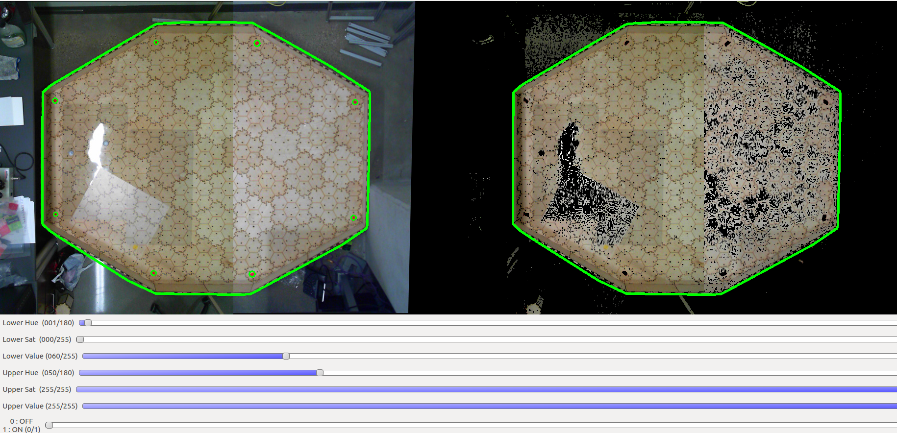
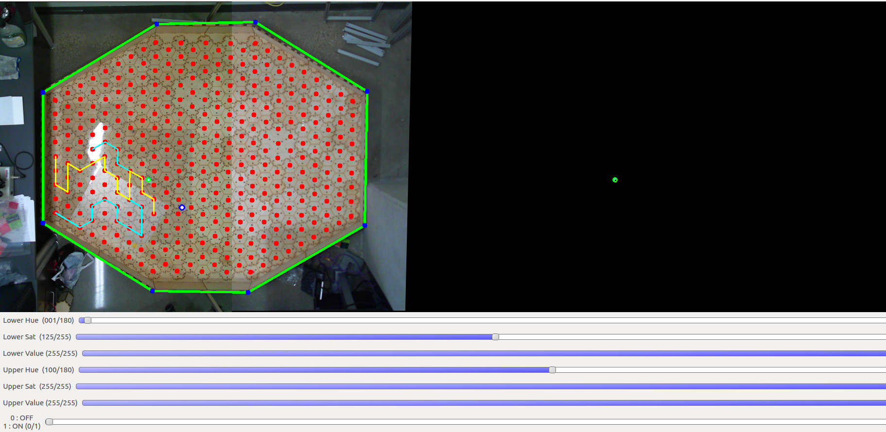
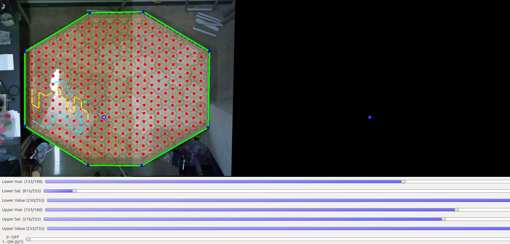

# Effect of Planning Depth in Predator-Prey Behavior
**Michael Wiznitzer**

Northwestern University: Final Project

## Calibration Procedures
In the [launch/color_calibration](launch/color_calibration) directory, you will find several calibration launch files. These are used as described below.

#### Maze Color Calibration
In order to find good HSV boundaries for color segmentation for obtaining the contour of the maze, run the following:

```
roslaunch maze_control boardcolor_calibration.launch
```

Move the sliders around until you are satisfied with the resulting boundaries as shown below:



Record the HSV upper and lower boundaries and enter them into the lower and upper birch parameters in the corresponding yaml file [here](../../param/mazecolor_calib.yaml)

#### Red Tape Color Calibration
In order to find good HSV boundaries for color segmentation for obtaining the red tape markers on the maze, run the following:

```
roslaunch maze_control redtapecolor_calibration.launch
```

Move the sliders around until you are satisfied with the resulting boundaries as shown below:


Record the HSV upper and lower boundaries and enter them into the lower and upper redtape parameters in the corresponding yaml file [here](../../param/mazecolor_calib.yaml)

#### Prey Color Calibration
In order to find good HSV boundaries for color segmentation for finding the prey sphero, run the following:

```
roslaunch maze_control preycolor_calibration.launch
```

Move the sliders around until you are satisfied with the resulting boundaries as shown below. If you would like to have the program circle the prey and predator spheros for feedback purposes, make sure to hit the "**c**" key after clicking on the **maze_node** image feed.



Record the HSV upper and lower boundaries and enter them into the lower and upper prey color parameters in the corresponding yaml file [here](../../param/spherocolor_calib.yaml)

#### Predator Color Calibration
In order to find good HSV boundaries for color segmentation for finding the predator sphero, run the following:

```
roslaunch maze_control predatorcolor_calibration.launch
```

Move the sliders around until you are satisfied with the resulting boundaries as shown below. If you would like to have the program circle the prey and predator spheros for feedback purposes, make sure to hit the "**c**" key after clicking on the **maze_node** image feed.



Record the HSV upper and lower boundaries and enter them into the lower and upper predator color parameters in the corresponding yaml file [here](../../param/spherocolor_calib.yaml)
